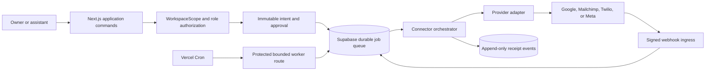

# Omnix Connector Security, Durable Jobs, Receipts, and Approvals

Status: Architecture approved for implementation after the Story 3.5 dependency is corrected  
Story: `3.5.connector-security-jobs-approvals.story.md`  
Decision: [ADR 3.5](../../.ai/decision-log-3.5-connector-platform.md)  
Runtime configuration contract: [connector-platform.example.yaml](config/connector-platform.example.yaml)  
Architecture readiness record: [3.5 architecture gate](../qa/gates/3.5-connector-security-jobs-approvals-architecture.yml)

## Overview and executive decision

Omnix will implement its shared connector foundation inside the approved stack: Next.js 15 route handlers on Vercel, Supabase Postgres/Auth, and a Supabase-backed durable job queue. Vercel Cron is a wake-up mechanism only; Postgres is the durable authority for intent, approval, lease, attempt, reconciliation, and receipt state.

This foundation enables, but does not itself complete, Gmail, Google Calendar, Mailchimp, Twilio texting, or Meta Instagram/Facebook. Each provider still requires a provider-specific story, production credentials, permissions or regulatory approval, real-account tests, and disconnect/revocation proof.

The dependency currently stated by Story 3.5 is incorrect. Story 3.5 does not require the full rich contact lifecycle in Story 3.2:

- Story 3.0 is the authority for workspace membership, owner/assistant roles, RLS, and `WorkspaceScope`.
- Story 3.1 is the authority for immutable activity evidence, tasks, idempotency, atomic operations, and CLI-first patterns.
- Story 3.2 adds contact lifecycle concepts that are orthogonal to connector security and job execution.

Story 3.5 may advance from Draft to Ready after SM/PO replaces the Story 3.2 dependency with Stories 3.0 and 3.1 and links this architecture set. Provider approval is not a blocker to implementing the common foundation; it is a blocker to calling any provider connection live or production-ready.

## 2. Scope and evidence boundary

### In scope

- Workspace-bound connector metadata and server-only encrypted secrets.
- Connector OAuth transactions kept separate from Supabase sign-in.
- Durable jobs with leases, fencing, idempotency, retry classification, and reconciliation.
- Immutable action intent versions, approval events, and execution receipt events.
- Owner/assistant authorization boundaries and policy snapshots.
- Signed webhook verification, replay protection, deduplication, and asynchronous normalization.
- Provider adapter contracts for Google, Mailchimp, Twilio, and Meta.
- CLI-first operations, observability, key rotation, rollout, and rollback.

### Out of scope

- Provider-specific user journeys and business operations.
- Contact lifecycle fields owned by Story 3.2.
- A claim that provider verification, Meta App Review, Google verification, or Twilio 10DLC approval has passed.
- A promise of exactly-once delivery across a remote provider boundary.
- Storage of email bodies, SMS bodies, DM contents, or OAuth tokens in operational logs or receipts.

## 3. Current-state impact map

| Existing authority | Current capability | Story 3.5 impact |
| --- | --- | --- |
| `lib/domain/workspace.ts` | Canonical `WorkspaceScope`, owner/assistant role, live/sample mode | Reuse unchanged; every connector command receives a resolved scope |
| `lib/data/supabase-workspace-scope.ts` | Unique active membership and personal workspace bootstrap | Reuse; do not accept workspace identity from browser payloads |
| `lib/data/authenticated-cli-context.ts` | End-user Supabase CLI context; rejects service keys | Reuse for owner/assistant CLI operations |
| `lib/data/automation-context.ts` | Server-only service-role automation binding | Reuse pattern for workers; never expose service role to UI/CLI |
| `lib/domain/activity.ts` and Story 3.1 repos | Immutable activities, mutable tasks, idempotency | Reuse semantics; add connector-specific durable job and receipt authorities |
| `0004_workspace_authority_audit.sql` | Workspace audit/correlation/RLS patterns | Follow its workspace/RLS conventions |
| `0005_crm_work_queue.sql` | Atomic task/activity RPC patterns | Reuse atomicity and idempotency patterns; it is not a provider queue |
| `components/google-sign-in.tsx` and `/auth/callback` | Supabase identity sign-in with `openid email profile` | Keep separate; connector consent cannot reuse the identity token |
| `/connections` | Truthful placeholder states | Preserve until each provider has real runtime evidence |

No current connector, token-vault, durable provider-job, approval, webhook, or provider-adapter implementation was found. The architecture is additive and preserves current routes and sample-mode behavior. Live connector operations must fail closed in sample mode.

## 4. Options considered

### Option A — Supabase durable queue plus Vercel Cron and Next.js workers

Postgres stores jobs and owns atomic claims. Vercel Cron invokes a protected route on a short cadence. The route claims a bounded batch using `FOR UPDATE SKIP LOCKED`, executes through adapters, and commits results only while its lease and fencing token are current.

Benefits:

- Fits the approved stack and current repository patterns.
- Keeps intent, approval, job, and receipt writes transactional.
- Adds no queue vendor at the expected 200–500 contact scale.
- Makes CLI inspection and recovery straightforward.

Costs and risks:

- Polling introduces bounded latency.
- Vercel plan frequency and function duration become operational constraints.
- The service-role worker requires strict isolation.
- Long-running workflows must be decomposed into small jobs.

### Option B — Supabase `pg_cron`/`pg_net` plus Edge Functions

Benefits:

- Scheduling is close to the database.
- Fewer Vercel cron assumptions.

Costs and risks:

- Introduces a second compute/runtime seam and a second secret-management path.
- Diverges from the approved Next.js route-handler operating model.
- Increases local/production parity and incident-debugging complexity.

### Option C — External workflow or queue service

Examples include a managed workflow engine or cloud task queue.

Benefits:

- Rich retry, scheduling, orchestration, and operational UI.
- Better fit if future workloads become high-volume or long-running.

Costs and risks:

- New vendor, cost, data-processing surface, and deployment dependency.
- Transactional intent-to-job consistency requires an outbox bridge.
- Not justified by current scale or approved stack.

### Decision

Choose Option A. Revisit Option C only when measured queue age, sustained throughput, provider workflow duration, or operational burden exceeds the documented thresholds. Option B is not the fallback because it creates two application runtimes without removing the database queue requirement.

## Architecture

### Architecture diagram



```text
Browser / CLI
  -> authenticated application command
  -> WorkspaceScope + role authorization
  -> action intent/version
  -> owner approval (default for external writes)
  -> atomic approve-and-enqueue RPC
  -> connector_jobs (durable authority)

Vercel Cron --CRON_SECRET--> bounded worker route
  -> service-role worker context
  -> claim RPC: SKIP LOCKED + lease + fencing token
  -> orchestrator
       -> decrypt secret only in memory
       -> provider adapter
       -> accepted | safe_retry | reconcile_required | terminal
  -> append-only receipt event
  -> job transition guarded by fencing token

Provider webhook
  -> raw bytes + opaque endpoint key
  -> signature and replay verification
  -> deduplicated webhook delivery record
  -> enqueue normalization/reconciliation job
  -> fast 2xx response
```

### Trust zones

1. Browser/client: no client secrets, refresh tokens, provider access tokens, signing secrets, service keys, or decrypted payloads.
2. User-authenticated server: workspace-scoped metadata, intents, approvals, redacted receipts; no generic secret access.
3. Worker route: server-only service role and KEK access, fixed adapter registry, bounded claims.
4. Private database schema: encrypted secrets, OAuth transactions, webhook dedupe material, sync cursors.
5. Provider boundary: all outcomes are treated as at-least-once and potentially ambiguous until recorded or reconciled.

## Components and data authorities

- **Workspace authorization**: resolves the authenticated membership and canonical `WorkspaceScope` before any connector command.
- **Connector vault**: persists redacted connection metadata separately from encrypted, server-only credential envelopes.
- **Intent and approval authority**: binds an owner decision to an immutable action version, canonical payload hash, policy version, and connection.
- **Durable job engine**: owns scheduling, claims, leases, fencing, retry classification, reconciliation, and terminal job state.
- **Provider orchestrator and adapters**: decrypts secrets only in memory, invokes a fixed adapter registry, and translates provider outcomes into typed dispositions.
- **Webhook ingress**: verifies provider signatures and replay constraints over raw input before deduplicating and queuing asynchronous work.
- **Receipt authority**: stores append-only, redacted evidence of attempts, provider outcomes, reconciliation, revocation, and probes.

Names are logical and may be adjusted to project naming conventions during implementation. The ownership and invariants are mandatory.

### `connector_connections`

Workspace-visible, redacted metadata:

- `id`, `workspace_id`, `provider`, `provider_account_key_hash`, `display_label`.
- `status`: `authorizing`, `active`, `degraded`, `reauthorization_required`, `revoking`, `disconnected`, `disconnected_unconfirmed`.
- `granted_scope_set`, `remote_identity_summary`, `last_probe_at`, `last_error_category`.
- `created_by`, `created_at`, `updated_at`, `disconnected_at`.

Unique active connection semantics are provider-specific and defined in validated configuration. Owner-only mutations are the default. Assistants may read redacted health metadata when workspace policy allows.

### `connector_connection_secrets` (private schema)

- `connection_id`, `secret_type`, encrypted payload envelope, `secret_version`.
- `kek_version`, `created_at`, `refreshed_at`, `expires_at`, `destroyed_at`.

There is no browser grant and no ordinary RLS read path. Only narrowly scoped server functions and the worker repository may access ciphertext.

### `connector_oauth_transactions` (private schema)

- Hash of high-entropy state; encrypted PKCE verifier.
- Provider, requested scope bundle, workspace, user, membership, session-binding hash.
- Exact redirect URI, safe return path, expiry, and `consumed_at`.

Transactions are single-use and expire after ten minutes by default.

### `connector_action_intents` and immutable `connector_action_intent_versions`

- Human-readable summary and typed action name.
- Versioned canonical payload hash and encrypted `payload_ref`.
- Draft author, target connection, created time, compliance flags.
- Edits create a new version; an approved version can never be mutated.

### `connector_approval_events` (append-only)

- Intent/version/hash, actor, role snapshot, decision, reason, policy version, timestamp.
- No update/delete application API.
- Approval and job insertion occur in one transaction with a unique intent/version constraint.

### `connector_jobs`

- `workspace_id`, `connection_id`, provider, action, schema version.
- Encrypted `payload_ref` plus canonical payload hash; never routine message content.
- `idempotency_key`, `correlation_id`, priority, state, scheduled time.
- Attempt count, max attempts, last error category.
- `lease_owner`, `lease_expires_at`, monotonically increasing `fencing_token`.
- Provider request key and remote operation ID when available.

States:

```text
queued -> leased -> executing -> succeeded
                      |            
                      +-> retry_wait -> queued
                      +-> reconciliation_required -> succeeded | retry_wait | failed
                      +-> failed | dead_letter
queued/retry_wait -> cancelled (only before a remote side effect starts)
```

### `connector_receipt_events` (append-only)

Allowed event classes include `attempt.started`, `provider.accepted`, `provider.failed`, `provider.unknown`, `reconciliation.started`, `reconciliation.resolved`, `webhook.accepted`, `webhook.rejected`, `revocation.requested`, `revocation.completed`, and `connection.probed`.

Receipts contain provider operation IDs, timestamps, hashes, status, and redacted error categories—not access tokens, recipient addresses, message bodies, subjects, DM content, or provider raw payloads.

### `connector_webhook_deliveries`

- Connection derived from an opaque endpoint key whose hash is stored in the database.
- Provider delivery key where available, raw body hash, signature result, timestamp result.
- Received/processed times, duplicate marker, redacted outcome.

Raw bodies are not retained by default. A provider story must justify any exception with encryption, retention, and deletion controls.

### `connector_sync_cursors` and `connector_automation_policies`

Sync cursors are private, connection/stream-scoped, versioned, and encrypted when sensitive. Automation policies are versioned workspace rules containing exact action allowlists, limits, compliance requirements, and approval mode. A job carries the policy snapshot/version used at authorization time.

## 7. Authorization model

| Capability | Owner | Assistant | Worker |
| --- | --- | --- | --- |
| View redacted connection health | Yes | Policy-controlled | Yes |
| Start/complete connector authorization | Yes | No | No |
| Disconnect/revoke | Yes | No | Executes an owner-authorized request |
| Create/edit intent draft | Yes | Yes | No |
| Approve external write | Yes | No by default | No |
| Read encrypted secret | No direct API | No | Through narrow repository only |
| Execute job | No | No | Yes, after durable authorization |
| Retry/cancel eligible job | Yes | Policy-controlled operations only | Automated policy path |
| Change automation policy | Yes | No | No |

RLS applies to all workspace-visible tables. Private tables deny client roles entirely. A service role bypasses RLS and therefore must exist only inside the worker repository and migration/admin operations. Caller-supplied `workspace_id` is never trusted by a worker; it comes from the claimed job.

Security-definer functions must have an explicit `search_path`, schema-qualified objects, minimum grants, and revoked public execution. No function may accept arbitrary table names, SQL, provider endpoints, or workspace identities.

## Data Flow: Connector OAuth and account binding

Connector authorization is a different trust flow from “Sign in with Google.” Supabase Google sign-in remains identity-only (`openid email profile`). Gmail and Calendar permissions are requested later, incrementally, through the connector platform.

Flow requirements:

1. Resolve the authenticated user, unique active membership, and `WorkspaceScope`.
2. Create a ten-minute, single-use OAuth transaction containing a hashed random `state`, encrypted PKCE verifier, exact redirect, provider, requested scope bundle, and session/membership binding.
3. Redirect only to the adapter's compiled, allowlisted authorization endpoint.
4. On callback, verify state, expiry, single use, same session/user/membership/workspace, exact redirect URI, and PKCE before token exchange.
5. Resolve provider account identity and compare it with any connection/reconnection expectation.
6. Encrypt the credential envelope before persistence, create redacted metadata, consume the transaction atomically, and append a receipt.
7. Never place provider tokens in URLs, browser storage, analytics, exceptions, or response DTOs.

Reconnect and incremental-scope flows create new transactions. Token refresh uses a connection-level lock or optimistic `secret_version` so two workers cannot overwrite a rotated refresh token.

## 9. Encryption and key rotation

### Envelope format

- Algorithm: AES-256-GCM using Node's built-in cryptography.
- A random data-encryption key (DEK) encrypts each secret payload.
- A versioned key-encryption key (KEK) wraps the DEK.
- Associated authenticated data binds `workspace_id`, `connection_id`, provider, secret type, and record version.
- Persist ciphertext, IV/nonce, authentication tag, wrapped DEK, wrap IV/tag, and KEK version only.
- KEKs are server-only Vercel environment values: `OMNIX_CONNECTOR_KEK_ACTIVE_VERSION` and `OMNIX_CONNECTOR_KEK_<version>`; none may use a `NEXT_PUBLIC_` prefix.

Any AAD mismatch, tag failure, unknown key version, or malformed envelope fails closed and emits only a redacted security event.

### Rotation runbook

1. Generate and escrow a new KEK under the approved secret-management process.
2. Deploy it alongside the old key; set the active version for new writes.
3. Run a bounded, resumable CLI rewrap operation. Rewrap the DEK; do not decrypt provider tokens outside the server process.
4. Record counts and append a rotation receipt for each batch without exposing material.
5. Verify that no active envelope references the retiring version.
6. Preserve the old key through the documented recovery window, then remove it in a separate approved change.

Application rollback must retain both keys. Removing an old KEK before rewrap verification is a stop condition.

### Disconnect and cryptographic deletion

Disconnect is two phase. `revoking` immediately blocks new jobs. Omnix attempts provider revocation where supported, records the outcome, and cryptographically destroys the stored envelope after confirmed revocation or a documented provider “no revocation endpoint” result. Repeated unknown failures end in `disconnected_unconfirmed` with manual provider-revocation instructions; they must not be shown as confirmed.

## 10. Durable execution and failure semantics

### Claiming and fencing

The claim RPC:

- Selects only due `queued`/`retry_wait` jobs.
- Uses `FOR UPDATE SKIP LOCKED`, a deterministic priority/order, and a bounded batch.
- Sets `leased`, a random worker lease owner, expiry, and increments the fencing token.
- Returns the claimed rows after commit.

The worker transitions to `executing` and appends `attempt.started` before an external request. Any terminal update must compare job ID, lease owner, and fencing token. A late worker with an expired lease cannot overwrite the result of a newer attempt.

Cron has no durability responsibility. Duplicate and overlapping cron invocations are expected and safe. A sweeper requeues expired leases only after classifying whether the previous attempt was definitely not sent or must first be reconciled.

### Delivery semantics

Exactly-once execution cannot be guaranteed across a network boundary. Omnix guarantees:

- Exactly one durable approval-to-job insertion for an intent version.
- At-least-once worker pickup.
- Provider idempotency when the provider documents a key or unique resource strategy.
- No blind retry after an ambiguous, potentially non-idempotent send.

The adapter returns one typed disposition:

- `accepted`: remote ID or provider-confirmed success; append receipt and succeed.
- `safe_retry`: the request is proven not accepted, or provider idempotency makes retry safe.
- `reconcile_required`: outcome is unknown; schedule a provider lookup or require operator action.
- `terminal`: validation, permission, compliance, or permanent provider failure.

Gmail or Twilio sends that time out after the request may have left Omnix must enter reconciliation, not an automatic blind retry, unless the provider-specific implementation has documented idempotency evidence.

### Retry and rate limiting

- Respect provider `Retry-After` where present.
- Otherwise use bounded exponential backoff with jitter from validated configuration.
- Never retry permission, revoked credential, policy, invalid recipient, consent, or compliance failures automatically.
- Open a per-provider/connection circuit after configurable consecutive transient failures.
- `dead_letter` is visible and alertable; it is not silently discarded.

## Integration: Provider adapter seams

Adapters are pure provider translators. They receive ephemeral decrypted material and typed payloads from an orchestrator; they cannot access repositories or choose a workspace.

```ts
type ProviderDisposition =
  | { kind: "accepted"; remoteOperationId?: string; receipt: RedactedReceipt }
  | { kind: "safe_retry"; retryAt?: string; category: RetryableCategory }
  | { kind: "reconcile_required"; hint?: ReconciliationHint }
  | { kind: "terminal"; category: TerminalCategory };

interface OAuthConnectorAdapter {
  buildAuthorizationUrl(transaction: OAuthTransaction): URL;
  exchangeAuthorizationCode(input: VerifiedOAuthCallback): Promise<SecretEnvelopeInput>;
  resolveRemoteIdentity(secret: EphemeralSecret): Promise<RemoteIdentity>;
}

interface OperationConnectorAdapter<Action> {
  probe(context: AdapterContext): Promise<ProbeResult>;
  execute(action: Action, context: AdapterContext): Promise<ProviderDisposition>;
  reconcile(input: ReconciliationInput, context: AdapterContext): Promise<ProviderDisposition>;
  refresh(context: AdapterContext): Promise<SecretEnvelopeInput>;
  revoke(context: AdapterContext): Promise<RevocationResult>;
}

interface WebhookVerifier {
  verify(raw: RawWebhookRequest, connection: WebhookConnection): VerificationResult;
  normalize(raw: VerifiedWebhook): NormalizedWebhookEvent[];
}
```

Provider base URLs, OAuth endpoints, acceptable domains, scope bundles, action schemas, retry classes, and feature flags come from a schema-validated YAML document deployed with the application. No user input may override an endpoint.

## 12. Webhook integrity and replay protection

Common ingress sequence:

1. Read bounded raw bytes before JSON/form parsing.
2. Resolve the connection from an opaque endpoint key; never from a payload workspace ID.
3. Verify the provider signature against the exact raw bytes and externally visible URL rules.
4. Enforce a timestamp tolerance where the provider supplies a signed timestamp.
5. Derive a replay key from the provider delivery ID or a stable signature/timestamp/body hash combination.
6. Insert the delivery under a unique key. Duplicates return a success acknowledgement without a second business mutation.
7. Store only redacted metadata and enqueue normalization/reconciliation.
8. Return 2xx quickly after durable acceptance.

Provider constraints:

- Mailchimp: verify HMAC-SHA256 over `timestamp.raw_body` using the one-time signing secret and `X-Mailchimp-Signature`; default replay window is five minutes.
- Twilio: use the official SDK validator with the exact externally visible URL and all parameters. Status callbacks can arrive out of order; apply a monotonic status model and reconcile against the provider when needed.
- Meta: support the verification challenge and validate POST signatures with the app secret. The provider story must pin the Graph API version, approved assets, and exact permission set before enablement.
- Google: push/watch callbacks do not replace cursor-based reconciliation. Gmail `history.list` and Calendar `syncToken` expiration/full-resync paths belong to the provider stories.

Invalid signatures fail closed and cause no business mutation. Logging raw webhook bodies or signatures is prohibited.

## 13. Approval and automation model

External writes require owner approval by default. Assistants can prepare and revise drafts but cannot self-approve, connect accounts, disconnect accounts, rotate keys, or change policies.

Approval binds the immutable intent version, canonical payload hash, connection, action type, policy version, and role snapshot. Any edit creates a new version and returns the intent to pending. The approve-and-enqueue function locks and verifies the version/hash, appends the approval, and inserts the unique job in one transaction.

System jobs may perform read-only probes, token refresh, cursor reconciliation, and webhook normalization without human approval. Autonomous external writes are disabled in the foundation. A future policy can enable them only when all of the following are explicit:

- Exact action allowlist and target/resource constraints.
- Consent/compliance requirements.
- Per-run and per-period limits.
- Policy version snapshot on every job.
- Kill switch and owner-visible receipts.
- Tests proving the assistant cannot expand its own authority.

## 14. Provider boundary decisions

| Provider | Foundation choice | Production enablement boundary |
| --- | --- | --- |
| Google identity | Keep `openid email profile` in Supabase sign-in | Does not authorize Gmail or Calendar |
| Gmail | Start with the smallest action bundle, normally `gmail.send`; add metadata/read scopes only for an approved JTBD | Sensitive/restricted-scope verification and possibly an independent security assessment before server-side restricted data use |
| Google Calendar | Prefer an Omnix-created secondary calendar using `calendar.app.created`; request broader event access only when the user explicitly chooses it | Google OAuth client/configuration, consent-screen verification, real-account sync and revoke tests |
| Mailchimp | OAuth connection, selected audience, signed webhooks, cursor/reconciliation | Registered app, client secret, callback, audience ownership and real webhook tests |
| Twilio | Workspace-owned service connection using restricted API keys where available; signed status/inbound callbacks | Messaging Service/number, A2P 10DLC, consent/STOP/HELP/quiet-hours policy and real test numbers |
| Meta Instagram/Facebook | Adapter placeholder disabled by default; no guessed permission list | Developer app, Business Login, Business Verification/App Review, eligible Page and Instagram Professional account, pinned API version and approved permissions |

Mailchimp tokens may remain valid until revoked, which increases the importance of disconnect, probing, and cryptographic deletion. Google incremental authorization uses offline access only when background operation is required.

## Configuration contract

The deployable configuration is validated at boot against a versioned schema. Unknown providers, action types, scope bundles, retry categories, environment variable names, or endpoints fail startup in the affected runtime. Production cannot enable a provider whose required credential references, permissions, webhook verifier, and probe are incomplete. Parameters and options are grouped under `runtime`, `security`, `approvals`, `retry`, `providers`, and `feature_guards`.

```yaml
schema_version: "1.0"
runtime:
  batch_size: 10
  lease_seconds: 90
providers:
  google:
    enabled: false
feature_guards:
  reject_user_supplied_endpoint: true
```

The example contract is at `docs/architecture/config/connector-platform.example.yaml`. Secrets never appear in YAML; the file contains only environment variable names. Feature flags default to false.

Configuration changes are code-reviewed and deployment-versioned. Database policy rows cannot enable a provider disabled by deployment configuration.

## 16. CLI-first operating surface

The implementation must expose deterministic, redacted commands before depending on an operational UI:

- List connector definitions and effective feature flags.
- List workspace connections, scope bundles, health, and last probe.
- Initiate an authorization transaction and inspect its redacted state.
- Disconnect/revoke and report confirmed versus unconfirmed outcome.
- Draft, revise, approve, reject, and inspect action intents.
- Enqueue, cancel eligible, reconcile, retry eligible, or dead-letter jobs.
- Drain a bounded worker batch and sweep expired leases.
- Inspect redacted receipts and webhook delivery status.
- Report KEK version counts and run bounded DEK rewrap batches.

All commands resolve the same `WorkspaceScope` as the application, require an end-user token for user actions, reject service keys in user mode, accept a correlation ID, and support machine-readable output.

## Monitoring, observability and privacy

### Structured events

Use `connector-event.v1` JSON with correlation ID, provider, hashed workspace key, redacted connection key, job ID, action type, attempt, state, duration, fencing token, and error category. Never log secrets, OAuth codes, state values, recipient addresses, usernames, subjects, bodies, DM content, raw webhook payloads, or authorization headers.

### Metrics

- Due-job count and oldest due-job age.
- Lease expirations and stale fencing rejections.
- Attempts, success, safe retry, reconciliation, terminal failure, and dead letters by provider/action.
- Webhook accepted, invalid signature, stale timestamp, and replay counts.
- Token refresh, probe, and revocation failures.
- Pending approval age.
- Active envelope counts by KEK version.

### Alerts

- Oldest due job exceeds its configured SLO.
- Any dead letter or repeated reconciliation-required event exceeds threshold.
- Repeated `auth_invalid` or revocation failures.
- Webhook verification failures spike.
- No successful cron drain for more than two expected intervals.
- A retiring KEK remains in use past its deadline.

Receipts are the workspace-facing audit record. Logs and metrics are operational telemetry and must not substitute for durable receipts.

## Risks, security threat model and controls

| Threat | Required control |
| --- | --- |
| OAuth CSRF or account swap | Random hashed state, PKCE, single-use expiry, session/user/membership/workspace/redirect binding, remote identity check |
| Token theft from database or logs | Private schema, AES-GCM envelope encryption, versioned KEK, DTO/log allowlists, no browser access |
| Assistant privilege escalation | Workspace RLS, owner-only commands/RPCs, immutable approval version/hash, no assistant policy mutation |
| Service-role abuse | Worker-only client, no caller workspace, narrow repositories/functions, audit/correlation, no generic SQL endpoints |
| Forged or replayed webhook | Raw-body signature, timestamp tolerance, opaque endpoint, unique replay key, fail closed |
| Approval/edit race | Immutable versions and atomic compare/approve/enqueue transaction |
| Duplicate or split-brain worker | Idempotency keys, lease owner, expiry, fencing token, compare-and-set completion |
| SSRF/endpoint injection | Compiled/validated endpoint allowlist; provider region/server-prefix validation |
| PII leakage and excessive retention | Encrypted payload references, metadata-only receipts, bounded retention, no content logs |
| Provider outage or quota exhaustion | Retry-After, jitter, circuit breaker, bounded attempts, visible dead letter/reconciliation |
| Out-of-order callback | Monotonic event transition plus provider reconciliation |

## Testing and verification strategy

### Unit

- Canonical payload hashing and immutable version binding.
- Redaction allowlists.
- AES-GCM encrypt/decrypt, AAD tamper, wrong key/version, malformed envelope, rewrap.
- OAuth state, PKCE, session/account binding, expiry and replay.
- Retry classifier and provider dispositions.
- Approval state machine and policy limits.
- Provider webhook signature/timestamp validators.
- Lease/fencing transitions.

### Database and integration

- Two-workspace isolation and cross-workspace denial.
- Owner/assistant capability matrix.
- No client grants on private tables.
- Concurrent `SKIP LOCKED` claims, lease expiry, and stale fencing rejection.
- Unique idempotency and atomic approve-and-enqueue.
- Append-only approvals/receipts.
- Webhook replay deduplication.
- Security-definer privilege and `search_path` tests.
- Worker rejection of caller-provided scope and user-path rejection of service keys.

### Contract and chaos

- Provider sandbox or deterministic fake for authorization, refresh, probe, execute, reconciliation, webhook, and revoke.
- Crash after `attempt.started` but before the provider call.
- Crash after provider acceptance but before receipt commit.
- Duplicate/overlapping cron invocations.
- Duplicate and out-of-order webhooks.
- 429, transient 5xx, timeout, revoked token, expired cursor, and key rotation during a job.

### Quality and acceptance

- `npm run lint`, `npm run typecheck`, `npm test`, production build, and database tests.
- CLI smoke tests for every operating command.
- Browser accessibility/responsive coverage for operational views when UI is implemented.
- Real-account UAT per provider covering authorization, refresh, scope display, one safe operation, webhook/reconciliation where applicable, receipt, disconnect, revoke, and post-revocation failure.

A local green build or deterministic fake is not live-provider evidence.

## Performance and capacity boundaries

- Worker claims and execution are bounded by configured batch size and maximum runtime; no request drains an unbounded queue.
- Queue age, lease expiry, provider rate limits, and reconciliation volume are measured before concurrency is increased.
- Provider calls never hold a database transaction open; the claim commits before network I/O and completion uses fencing compare-and-set.
- Payload content remains behind encrypted references so queue scans and operational views stay metadata-only.
- The design targets the documented 200–500 contact operating scale. A managed workflow platform is reconsidered only when measured SLO, throughput, duration, or operational burden crosses the ADR triggers.

## Deployment, rollout and rollback

### Rollout

0. Correct Story 3.5 dependency; approve this ADR/config/gate; keep all providers disabled.
1. Add forward-only schema/RLS/private grants, crypto, redacted repositories, and CLI diagnostics.
2. Add job/approval/receipt/worker mechanics with deterministic fake adapters and no external calls.
3. Pilot one provider-specific vertical slice behind an owner/workspace allowlist.
4. Complete provider-specific verification and real-account UAT one provider at a time.
5. Add assistant-facing policy flows only after role-escalation, limit, receipt, and kill-switch tests pass.

### Rollback

- Disable the provider flag and stop new enqueue first.
- Preserve connection metadata, jobs, approvals, and receipts for audit.
- Drain, reconcile, or cancel only jobs whose remote side effect has not begun.
- Revoke/cryptoshred through the disconnect process when the connector itself is withdrawn.
- Roll back application code independently; use forward fixes for database migrations, never destructive down migrations in an incident.
- Keep old and new KEKs until rewrap verification is complete.
- After Vercel deployment rollback, explicitly verify cron configuration because deployment rollback does not guarantee cron rollback.

## 21. External prerequisites and blockers

### Shared platform

- Live Supabase project, reviewed migrations/RLS/grants, backup/restore plan, and server-only service-role secret.
- Vercel production HTTPS domain, `CRON_SECRET`, production KEKs, log/metric destination, and a plan supporting the required cron frequency and function duration. A once-daily imprecise cron is insufficient for interactive connectors.
- Privacy policy, deletion/retention schedule, incident response, key escrow/rotation ownership, and provider DPA review.
- Named owner for connection administration and a documented assistant access policy.

### Google

- Google Cloud OAuth client, enabled APIs, exact redirect domains, privacy/data-deletion links, consent-screen verification.
- Verification for sensitive scopes; additional assessment if restricted Gmail data is stored or transmitted server-side.
- Real realtor and assistant authorization/revocation UAT.

### Mailchimp

- Registered OAuth app, client secret, HTTPS callback, selected-audience semantics, one-time webhook signing secret, and real-audience UAT.

### Twilio

- Restricted API key where supported, Messaging Service/number, signed callback configuration.
- A2P 10DLC brand/campaign approval for US 10-digit application messaging.
- Consent evidence, STOP/HELP handling, quiet-hours/legal review, and controlled real-number tests.

### Meta

- Meta developer app, Business Login, Business Verification and App Review.
- Eligible Facebook Page and Instagram Professional account.
- Exact Graph API version, approved permissions/assets, webhook configuration, reviewer test assets, and a written DM-to-CRM JTBD.

These prerequisites block a live/production claim; they do not block implementation and testing of the provider-disabled foundation.

## 22. Architecture implementation gate

The architecture decision is **GO after story correction**, not a QA verdict. Implementation may start only when:

- Story 3.5 names Stories 3.0 and 3.1 as prerequisites and no longer attributes workspace authority to Story 3.2.
- The story links this document, the ADR, configuration contract, and architecture readiness record.
- Product confirms that connection administration is owner-only and external writes require owner approval by default.
- The implementation plan preserves separate Supabase sign-in and connector OAuth.
- All providers remain disabled until their provider-specific acceptance evidence exists.

Stop implementation if any proposal exposes provider secrets to browser code, accepts workspace/provider endpoints from caller input, bypasses immutable approval binding, retries an ambiguous non-idempotent send blindly, weakens existing RLS, or removes current truthful placeholder states before live evidence exists.

## 23. Primary technical references

- Google OAuth web-server flow and incremental authorization: <https://developers.google.com/identity/protocols/oauth2/web-server>
- Google OAuth policies: <https://developers.google.com/identity/protocols/oauth2/policies>
- Gmail scopes: <https://developers.google.com/workspace/gmail/api/auth/scopes>
- Gmail synchronization: <https://developers.google.com/workspace/gmail/api/guides/sync>
- Calendar authorization and scopes: <https://developers.google.com/workspace/calendar/api/auth>
- Calendar synchronization: <https://developers.google.com/workspace/calendar/api/guides/sync>
- Mailchimp OAuth: <https://mailchimp.com/developer/marketing/guides/access-user-data-oauth-2/>
- Mailchimp signed webhooks: <https://mailchimp.com/developer/marketing/guides/sync-audience-data-webhooks/>
- Twilio request authentication: <https://www.twilio.com/docs/usage/requests-to-twilio>
- Twilio webhook security: <https://www.twilio.com/docs/usage/webhooks/webhooks-security>
- Twilio message status callbacks: <https://www.twilio.com/docs/messaging/guides/track-outbound-message-status>
- Twilio A2P 10DLC: <https://www.twilio.com/docs/messaging/compliance/a2p-10dlc>
- Meta Messenger Platform webhook collection: <https://www.postman.com/meta/messenger-platform-api/folder/22794852-b5d97624-14d8-4e67-a2e4-529add49ca58>
- Vercel cron management and failure semantics: <https://vercel.com/docs/cron-jobs/manage-cron-jobs>
- PostgreSQL `SKIP LOCKED`: <https://www.postgresql.org/docs/17/sql-select.html>
- Supabase RLS: <https://supabase.com/docs/guides/database/postgres/row-level-security>
- Supabase API security and service roles: <https://supabase.com/docs/guides/api/securing-your-api>
